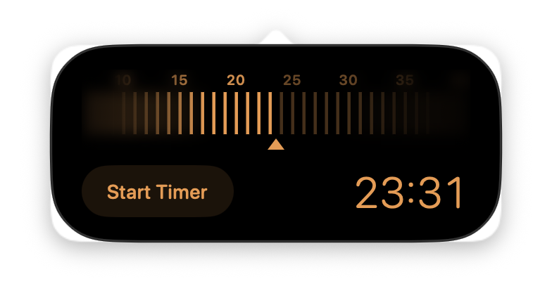
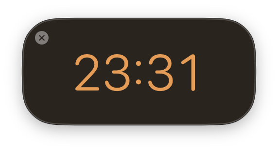
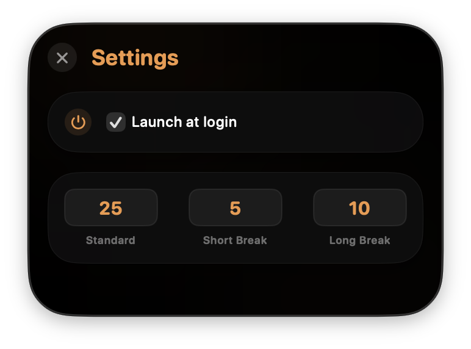
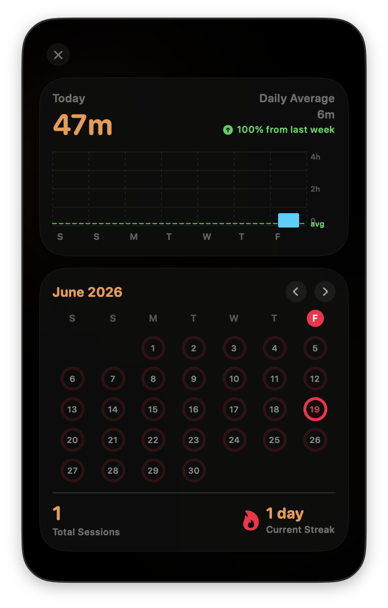

# Promodo Timer 🍅

A beautiful, minimal, and completely free Pomodoro Timer for macOS that lives in your Menu Bar. Designed to help you stay focused, build productive habits, and track your daily & weekly work history.

---

## 📸 Screenshots

<p align="center">
  
  <br>
  <i>Main Timer View (lives in the macOS status menu bar)</i>
</p>

<p align="center">
  
  &nbsp;&nbsp;&nbsp;&nbsp;
  
</p>
<p align="center">
  <i>Detached Floating Window (Left) & Glassmorphic Settings Panel (Right)</i>
</p>

<p align="center">
  
  <br>
  <i>Apple Fitness-Style Activity Rings & Weekly/Monthly Metrics Dashboard</i>
</p>

---

## ✨ Features

- **Menu Bar Integration**: Quick access to your timer right from the macOS status bar, displaying remaining time in a monospaced font.
- **Ruler Slider**: Intuitive sliding control to easily set your focus duration.
- **Detachable Window**: Want to keep an eye on your timer? Detach it into a floating, picture-in-picture style window that stays on top of your work.
- **Detailed History Dashboard**:
  - **Apple Fitness-Style Activity Rings**: Visual progress rings tracking your daily sessions.
  - **Weekly Analytics**: A beautiful bar chart showing your daily focus metrics with average lines and progress trends.
  - **Streak Tracker**: Tracks your consecutive days of productivity.
- **Launch at Login**: Starts automatically when you boot your Mac so you never forget to track your focus.
- **100% Private**: No tracking, no data collection, no ads. Just you and your focus.

---

## 🚀 How to Install & Run

1. Go to the [Releases](https://github.com/2bsyed/Promodo-Timer/releases) page of this repository.
2. Download the `Promodo-Timer.dmg` disk image.
3. Open the disk image and drag the `Timer.app` icon onto the `Applications` folder shortcut.
4. Launch the app!

### ⚠️ Troubleshooting: "Timer.app is damaged..." Error

Because this application is not notarized by Apple, Gatekeeper will flag it with a message stating that it is **"damaged and can't be opened"** when downloaded from the internet.

**To resolve this and allow the app to run:**

1. Open your macOS **Terminal** app (search for it in Spotlight).
2. Run the following command:
   ```bash
   xattr -cr /Applications/Timer.app
   ```
3. Open the app again, and it will run perfectly!

Alternatively, you can right-click (or Control-click) `Timer.app` in your Applications folder, select **Open**, and then click **Open** in the confirmation dialog to whitelist it.

---

## 🛠️ Built With

- **SwiftUI**: Modern user interfaces for macOS.
- **AppKit**: For status bar integration, popover management, and native windowing.
- **LaunchAtLogin-Modern**: Seamless launch-at-login utility integration.

---

## 📝 License

Distributed under the GNU GPLv3 License. See `LICENSE` for more information.

---

*Made to boost focus and productivity.*
