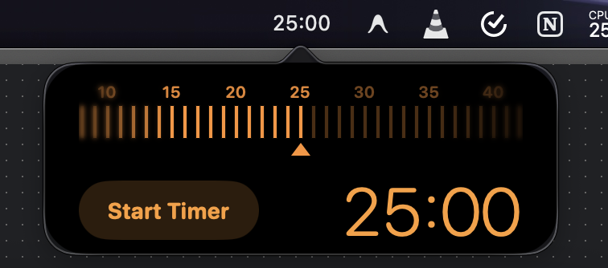

# Promodo Timer 🍅

A beautiful, minimal, and completely free Pomodoro Timer for macOS that lives in your Menu Bar. Designed to help you stay focused, build productive habits, and track your daily & weekly work history.

---

## ✨ Features

- **Menu Bar Integration**: Quick access to your timer right from the macOS status bar, displaying remaining time in a monospaced font.
- **Ruler Slider**: Intuitive sliding control to easily set your focus duration.
- **Detachable Window**: Want to keep an eye on your timer? Detach it into a floating, picture-in-picture style window that stays on top of your work.
- **Detailed History Dashboard**:
  - **Apple Fitness-Style Activity Rings**: Visual progress rings tracking your daily sessions.
  - **Weekly Analytics**: A beautiful bar chart showing your daily focus metrics with average lines and progress trends.
  - **Streak Tracker**: Tracks your consecutive days of productivity.
- **Launch at Login**: Starts automatically when you boot your Mac so you never forget to track your focus.
- **100% Private**: No tracking, no data collection, no ads. Just you and your focus.

---

## 🚀 How to Install & Run

1. Go to the [Releases](https://github.com/2bsyed/Promodo-Timer/releases) page of this repository.
2. Download the `Promodo-Timer.zip` file.
3. Extract the downloaded archive.
4. Drag `Timer.app` to your **Applications** folder.
5. Double-click to launch!

> **Note**: Because this application is not notarized by Apple, when launching for the first time, you may need to right-click (or Control-click) the application, select **Open**, and click **Open** in the confirmation dialog.

---

## 🛠️ Built With

- **SwiftUI**: Modern user interfaces for macOS.
- **AppKit**: For status bar integration, popover management, and native windowing.
- **LaunchAtLogin-Modern**: Seamless launch-at-login utility integration.

---

## 📝 License

Distributed under the GNU GPLv3 License. See `LICENSE` for more information.

---

*Made to boost focus and productivity.*
